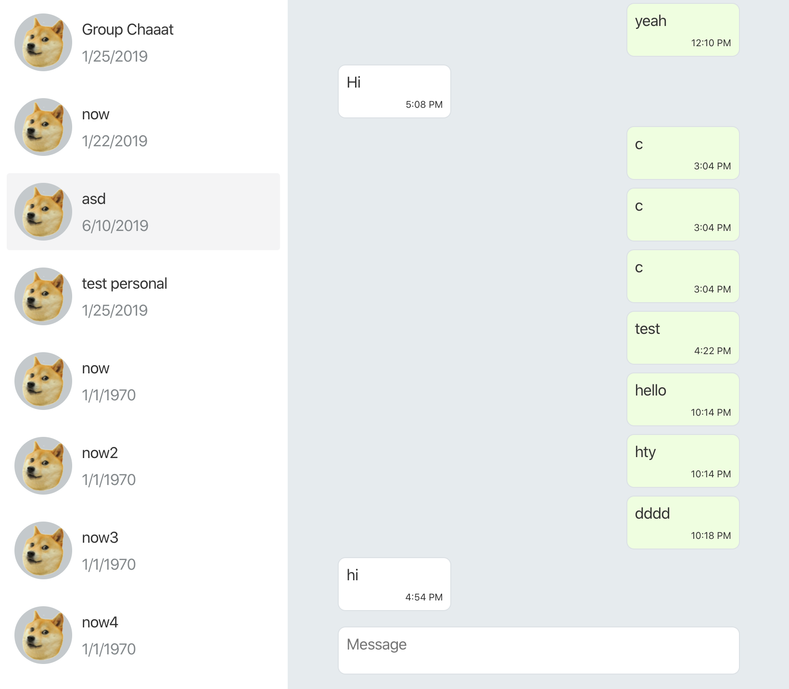

# INSTALL

This is simple `Create React App` application. Run `yarn`(`npm i`) and `yarn start`(`npm run start`) in order to install dependencies and to run application;

# FEATURES

1. Messages list is reversed. To show new messages ast the bottom of the list;
2. You can send new message on `enter`, however on `shift + enter` you can add new line;
3. User is hardcoder by default to `{ id: 1 }`, but you can change the user by adding to the query string: `http://localhost:3000/?userId=2`;
4. When you hit `enter` to send a new message UI doesn't wait response from a server. it was done intentionally to show some `Optimistic` UI approach;
5. Selected chat is highlighted.
6. Date format internationalization.
7. BEM naming convetion for the styles.
8. Will work on last 1 version of: Edge, Firefox, Chrome.

# WHAT TO IMPROVE

1. There is not much of decomposition, because app itself quite small and simple. The only component that I moved out of the `App` is `Input` component. Because `Input` was sharing state with `App` and affected the performance of the whole app;
2. It would be nice to add `Proptypes` or` Typescript` to describe data structures in the app more eloquently;
3. This app could have been implemented using `Websockets` to make this app more responsive and reactive;
4. Missing `esLint` config;
4. No tests though, sorry :)
